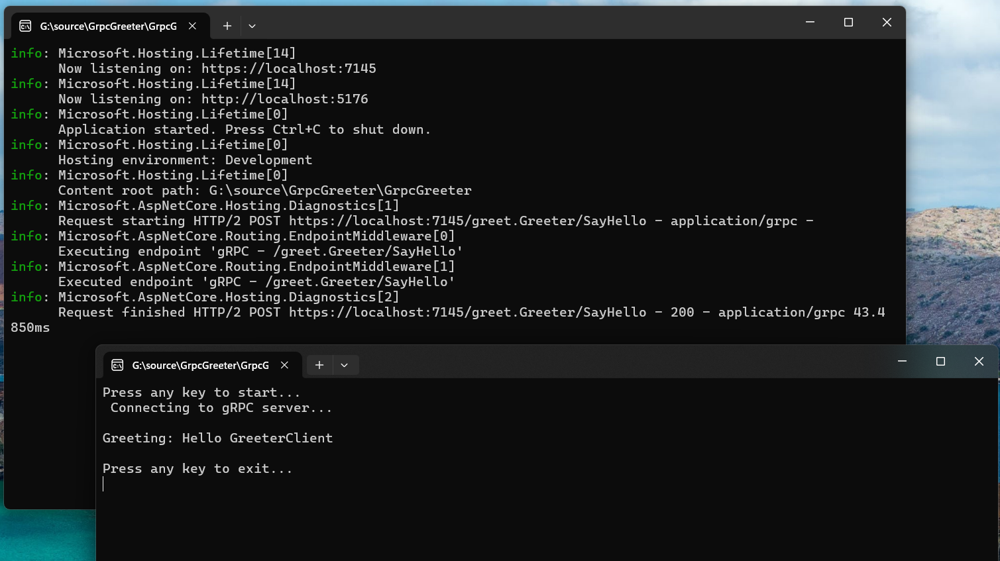

# ASP.NET Core gRPC Server & Client Demo

This is a simple demo of gRPC server and client using ASP.NET Core. The server is a simple gRPC service that returns a greeting message. The client is a console application that calls the server and displays the greeting message:

